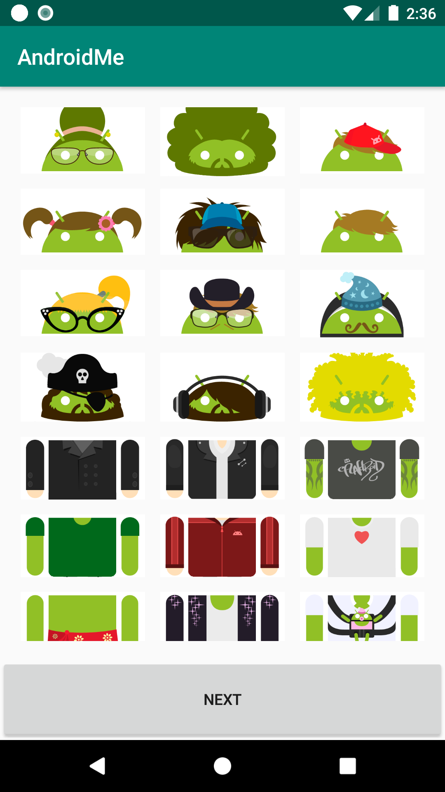
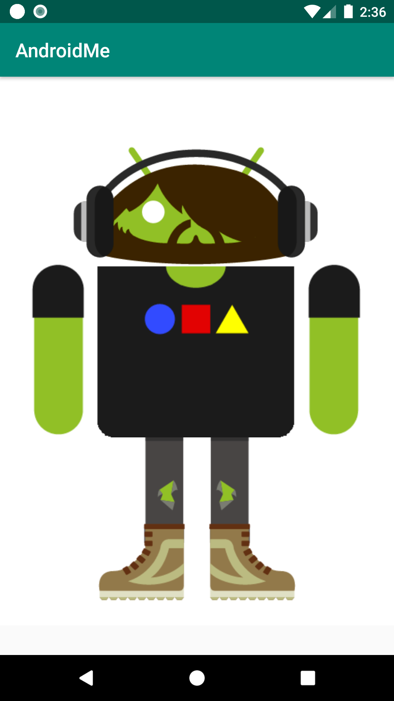

## AndroidMe
App that lets you style your own Android! This uses Fragments to create a flexible and responsive UI.

This is a exercise repository for the AndroidMe example app which is part of the [Advanced Android App Development course on Udacity](https://www.udacity.com/course/advanced-android-app-development--ud855).

# screenShots
 
